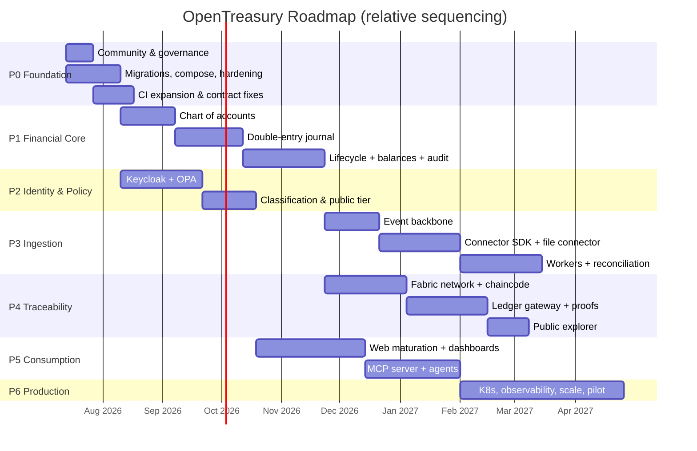
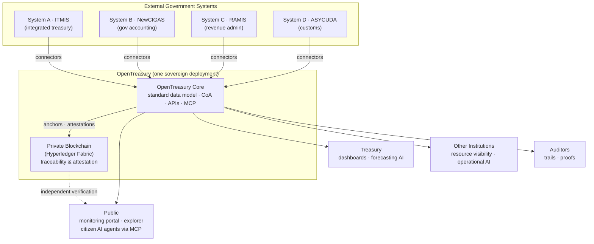
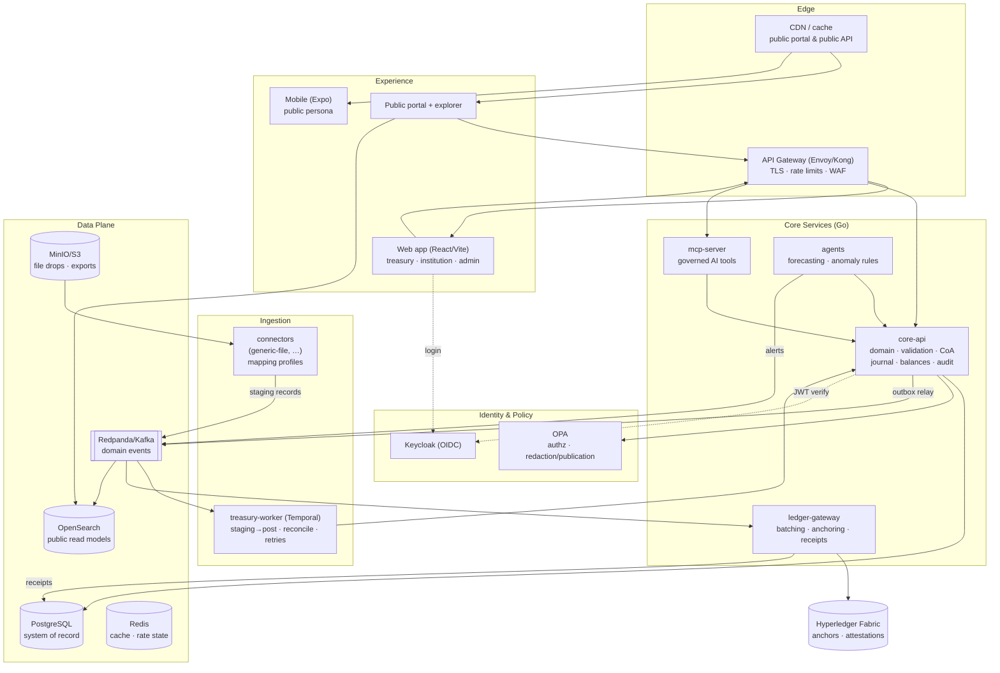
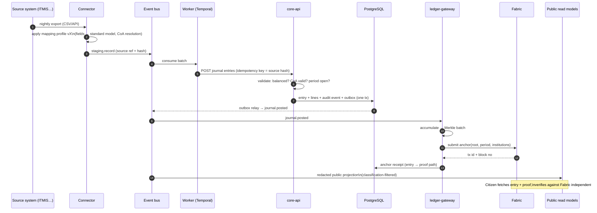
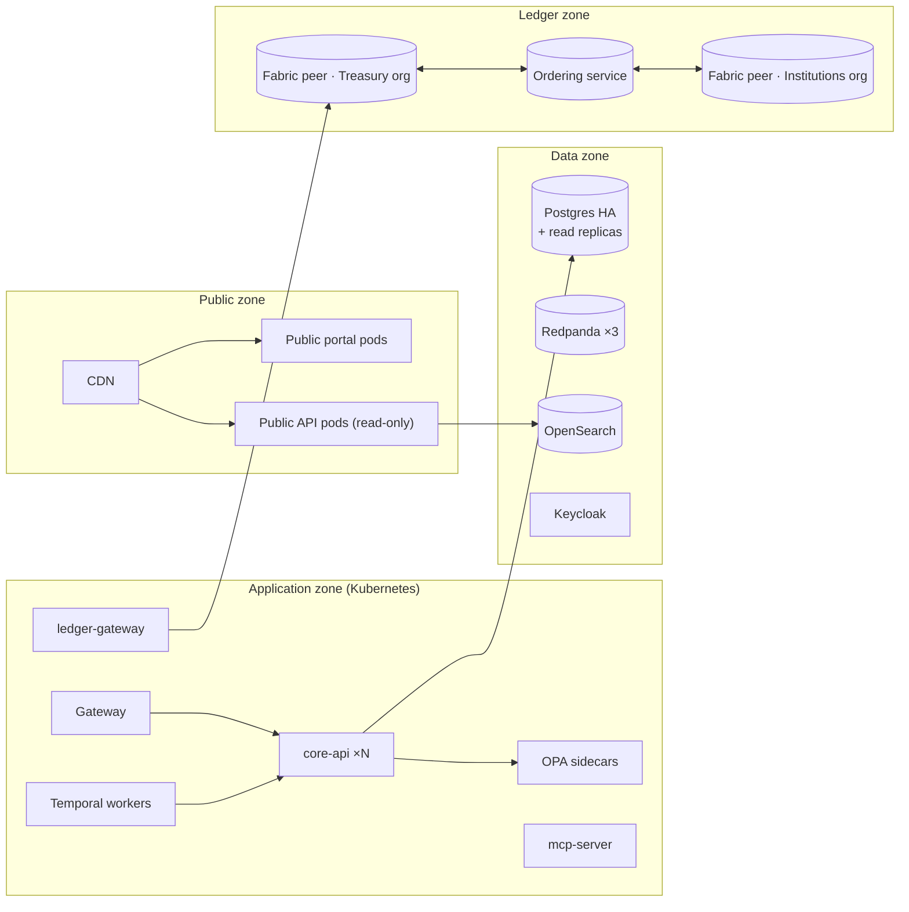
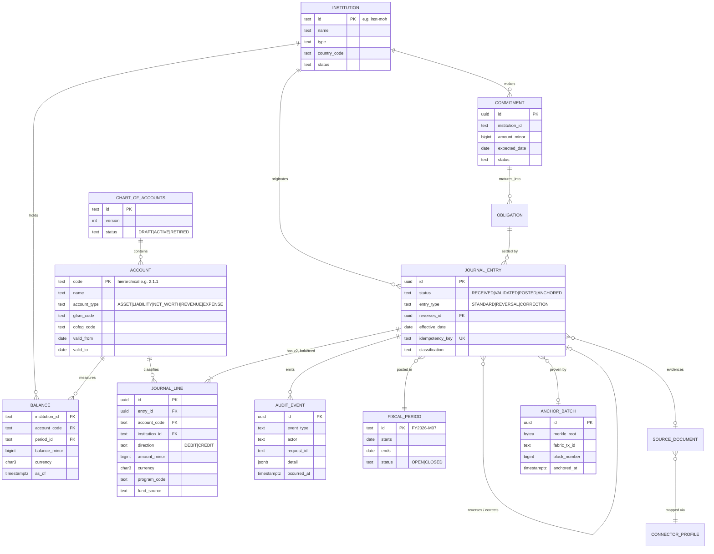
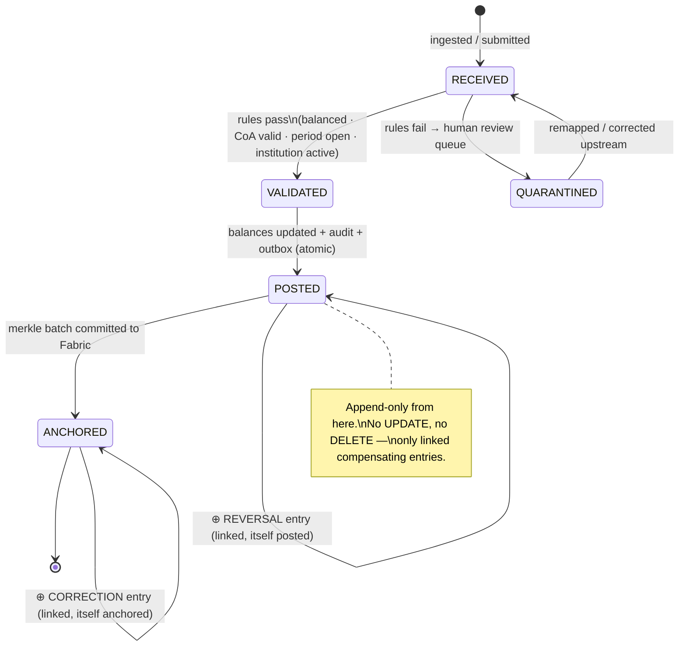

# OpenTreasury — Product & Architecture Blueprint

| | |
|---|---|
| **Status** | Draft for review |
| **Date** | 2026-07-09 |
| **Supersedes** | `docs/opentreasury-implementation-plan.md` (2026-06-28) — that document remains valid for stack selection; this document adds the full business analysis, current-state audit, target architecture, and phased implementation plan |
| **Source inputs** | "2026 OpenTreasury Architecture Designs" concept deck (2026-06-25), full codebase audit of branch `develop` @ `aeb4d5c` |
| **Audience** | Maintainers, contributors, prospective government adopters, security reviewers |

---

## 0. Executive Summary

OpenTreasury is an open-source **public-finance transparency and treasury-management platform**. It connects a government's existing finance systems (ITMIS, NewCIGAS, RAMIS, ASYCUDA and similar) through a **plugin connector architecture**, normalizes their data into a **standard stocks-and-flows treasury data model** built on a **configurable chart of accounts**, keeps **PostgreSQL as the operational system of record**, anchors tamper-evident traceability events to a **private Hyperledger Fabric network**, and exposes the result to three audiences — **treasury**, **other government institutions**, and **the public** — through dashboards, REST APIs, **MCP endpoints for AI agents**, and a public blockchain explorer.

The strategic bet is threefold:

1. **Transparency as infrastructure.** Every fund movement in public finance becomes monitorable, verifiable, and explainable — not through trust in a portal, but through cryptographic anchoring that the public can independently verify.
2. **AI-native from day one.** Treasury forecasting, anomaly monitoring, and citizen-facing question answering are delivered by AI agents consuming the same governed MCP endpoints as everyone else — with the right privacy and permission levels enforced below the agent, never by the agent.
3. **Open source as the trust model.** Governments will not adopt a black box for public money. Every validation rule, redaction policy, and anchoring proof is inspectable code.

**Where we are today (audited 2026-07-09):** a working but minimal vertical slice — a Go core API with 6 endpoints (transaction create/validate/list, institutions, synthesized audit events, health), two Postgres tables, and a single-page React dashboard. All other services (connectors, ledger gateway, MCP server, workers, chaincode, OPA policies, infra, mobile) are print-statement stubs or empty directories. There is **no authentication, no authorization, no chart of accounts, no balances, no double-entry semantics, no event pipeline, and no blockchain integration** yet. Section 3 contains the complete audit.

**What this document delivers:** the implementation plan (Section 1, for your review), the business analysis (Section 2), the honest current-state audit (Section 3), and the full target architecture (Sections 4–11) that takes this codebase from prototype to a system a government can run and millions of citizens can query.

---

## 1. Implementation Plan

> This is the section to review first. Everything after it is the supporting analysis and target design that the plan builds toward.

### 1.1 Guiding Principles

1. **Correct-by-construction financial core before features.** Double-entry semantics, immutability, and the chart of accounts come before any dashboard, agent, or blockchain work. A transparency platform with wrong balances is worse than no platform.
2. **Security is a phase-0 concern, not a hardening pass.** Identity, authorization, and redaction land before any real data flows. Until then the system must be treated — and labeled — as a demo.
3. **Vertical slices over horizontal layers.** Each phase ends with a demoable, end-to-end capability ("a CSV from a mock ITMIS lands as posted journal entries visible in the dashboard"), not a completed layer.
4. **Deployment-per-government, scale-per-public.** OpenTreasury is not one global SaaS. Each government runs its own sovereign deployment; the *public portal* of each deployment is the mass-scale surface (millions of citizens). Architecture decisions follow from this split (Section 4.1).
5. **The community is a workstream.** CONTRIBUTING, governance, ADRs, a connector conformance suite, and good-first-issues are deliverables with the same status as code.
6. **Everything the public sees must be independently verifiable.** If we publish a number, we publish the means to check it.

### 1.2 Workstreams

Work is organized into seven parallel workstreams. Phases (1.3) sequence the milestones; workstreams describe ownership and continuity across phases.

| # | Workstream | Scope | Primary repo areas |
|---|---|---|---|
| W1 | **Financial Core** | Chart of accounts, double-entry journal, balances, fiscal periods, lifecycle, validation | `services/core-api`, `database/` |
| W2 | **Identity & Policy** | Keycloak OIDC, OPA authorization, data classification & redaction, multi-institution tenancy | `policies/`, `services/core-api` |
| W3 | **Ingestion & Connectors** | Connector SDK, mapping profiles, event bus, workers, idempotency, reconciliation | `services/connectors`, `workers/`, `packages/` |
| W4 | **Traceability & Ledger** | Fabric network, chaincode, ledger gateway, anchoring, balance proofs, public verification | `chaincode/`, `services/ledger-gateway` |
| W5 | **Experience** | Web dashboards (treasury / institution / public), public explorer, mobile app | `apps/web`, `apps/mobile`, `packages/ui` |
| W6 | **AI & MCP** | MCP server, forecasting agent, anomaly monitoring agent, NL query | `services/mcp-server` |
| W7 | **Platform & Community** | CI/CD, docker-compose, K8s/Helm, observability, security scanning, docs, governance, releases | `infra/`, `.github/`, `docs/`, root meta files |

### 1.3 Phases

Phases are sequenced by dependency, not by calendar. Each phase lists its epics with acceptance criteria and an explicit **exit criterion** — the demo that proves the phase is done. Rough effort is expressed in "engineer-weeks" (ew) assuming contributors familiar with the stack; treat as relative sizing, not commitments.

---

#### Phase 0 — Foundation & Trust Hardening

*Goal: the repo is safe to build on, safe to contribute to, and honest about what it is. No new product features.*

| Epic | Description | Acceptance criteria | Est. |
|---|---|---|---|
| **0.1 Community & governance files** | Add `CONTRIBUTING.md`, `SECURITY.md` (vuln disclosure process), `CODE_OF_CONDUCT.md`, `GOVERNANCE.md`, issue/PR templates, `docs/adr/` with ADR-0001 recording the architecture stance. Fix stale `docs/licensing.md` (Apache-2.0 already chosen). Decide whether `docs/` stays locally ignored or becomes tracked (recommendation: **track it** — public docs are a community asset; see 11.2). | Files exist, linked from README; first ADR merged; `docs/` decision recorded | 1 ew |
| **0.2 Migration tooling & schema integrity** | Adopt `golang-migrate`; add `.down.sql` files; add FK `treasury_transactions.institution_id → treasury_institutions.id`; add seed data for local dev; wire `make db-up / db-migrate / db-seed`. | `make db-migrate` runs against local Postgres; FK enforced; migration test executes SQL against a real ephemeral DB (testcontainers), replacing string-contains assertions | 2 ew |
| **0.3 Local environment** | `infra/docker/docker-compose.yaml` with Postgres + core-api + web; Dockerfiles for core-api; `.env.example` for web (`VITE_CORE_API_URL`) and API; `docs/development.md` updated. | `docker compose up` → working dashboard against real API in <5 min from clone | 2 ew |
| **0.4 Service hardening baseline** | Graceful shutdown (signal handling + `srv.Shutdown`); `http.Server` timeouts; panic-recovery middleware; request-size limits; structured logging (`slog`) with request IDs; `/readyz` that pings the DB (keep `/healthz` as liveness); DB pool tuning + `Ping` at startup; stop leaking internal error strings in 500 responses (error taxonomy: code + public message + logged detail); `go mod tidy`. | All items verifiable by tests; `curl /readyz` fails when DB is down; 500 bodies contain no SQL/driver text | 3 ew |
| **0.5 CI expansion** | Split verify into lint (golangci-lint, eslint+prettier for TS), test, build; add `govulncheck`, `gitleaks`, `npm audit` / `pnpm audit`; build+push container images on tag; CodeQL. | CI green on all gates; a seeded secret in a test PR is caught | 2 ew |
| **0.6 API contract honesty** | Fix OpenAPI drift found in audit: document 500s, document limit-clamping (or reject >100 with 400 — decide and record in ADR), fix `ErrInvalidAmount` misuse for bad `limit`, document CORS, add 409 for duplicate create (map Postgres unique violation → 409). Contract test asserts response schemas, not just path existence. | Contract test fails on any future drift; audit findings closed | 2 ew |

**Exit criterion:** a new contributor clones the repo, runs `docker compose up`, creates a transaction in the UI backed by real Postgres, reads CONTRIBUTING.md, and submits a PR that passes the full CI gauntlet — all without asking a maintainer anything.

---

#### Phase 1 — The Financial Core (Stocks & Flows)

*Goal: implement concept-deck capabilities #1 and #2 — a configurable chart of accounts and a standard data model representing stocks and flows — with double-entry integrity. This is the largest and most important phase.*

| Epic | Description | Acceptance criteria | Est. |
|---|---|---|---|
| **1.1 Chart of accounts** | Versioned, hierarchical CoA per deployment: account code, name, type (asset / liability / net-worth / revenue / expense), classification mappings (IMF GFSM 2014 economic classification; COFOG functional classification), validity windows, active flag. Import from CSV/JSON. CRUD API (admin-scoped later). Ship a reference CoA based on GFSM 2014 as seed data. | CoA importable; hierarchy queries (subtree rollups) correct; reference CoA seeds load; accounts are never hard-deleted (deactivation only) | 4 ew |
| **1.2 Double-entry journal (flows)** | Replace the single-sided `Transaction` with `JournalEntry` (header) + `JournalLine` (debit/credit, account, institution, amount-minor, currency). Entries must balance per currency. Multi-dimensional tagging: fund source, program/project, counterparty, source document ref. Existing `POST /v1/transactions` becomes a compatibility facade that generates a balanced entry. | Unbalanced entries rejected; property-based tests on balancing invariant; every posted line references a CoA account valid on the entry date | 5 ew |
| **1.3 Lifecycle state machine** | `RECEIVED → VALIDATED → POSTED → ANCHORED`, with `REVERSED` and `CORRECTED` as new linked entries (append-only; nothing is ever updated or deleted post-POSTED). State transitions recorded as domain events. Negative flows modeled as reversals/credits, not negative originals. | State diagram in code matches Section 5.3; illegal transitions rejected with typed errors; reversal links navigable both ways | 3 ew |
| **1.4 Balances (stocks)** | Materialized per-account, per-institution, per-period balances updated transactionally with posting; point-in-time balance queries; fiscal period model (open/close periods; posting into closed periods rejected). | Balance = sum of posted lines, verified by an invariant-checking job; period close blocks back-posting; balance query p95 < 100 ms on 10 M lines (benchmarked) | 4 ew |
| **1.5 Real audit events** | Replace synthesized audit events with a real append-only `audit_events` table written in the same DB transaction as the domain change (who, what, before/after refs, request ID). Every state transition and every admin action emits one. | Audit list endpoint reads real rows; no code path mutates domain state without an audit row (enforced by repository design + tests) | 2 ew |
| **1.6 API v1 consolidation** | Pagination becomes cursor-based; idempotency keys on all writes (`Idempotency-Key` header, replay-safe); consistent error envelope with machine-readable codes; OpenAPI updated; currency validation against the real ISO 4217 set; amount/date/length bounds from audit closed. | Replayed create with same key returns same result, no duplicate; contract tests green | 3 ew |

**Exit criterion:** demo — load the reference chart of accounts, post a balanced multi-line journal entry via API, watch institution balances update, reverse the entry, and show the full audit trail of every step — with the invariant checker proving stocks ≡ Σ flows.

---

#### Phase 2 — Identity, Authorization & Tenancy

*Goal: the system can distinguish treasury, institutions, and the public, and enforces the "right level of privacy and permissions" (concept-deck capability #5) below every API.*

| Epic | Description | Acceptance criteria | Est. |
|---|---|---|---|
| **2.1 Keycloak integration** | OIDC login for web; JWT validation middleware in core-api; service accounts (client-credentials) for connectors/workers; local realm config in docker-compose with seeded demo users (treasury-admin, institution-user, auditor). | All non-public endpoints 401 without a valid token; tokens carry institution + role claims | 3 ew |
| **2.2 OPA authorization** | Rego policies in `policies/opa/` (finally real): role × resource × institution-scope decisions; policy bundle build + tests in CI; decision logging. Core-api consults OPA (embedded lib or sidecar — ADR) on every request. | Institution user cannot read another institution's unpublished data (tested); policy change requires no core-api redeploy; every deny is logged with reason | 4 ew |
| **2.3 Data classification & redaction** | Classification levels on fields (`PUBLIC / INSTITUTION / TREASURY / RESTRICTED`); publication policy (also Rego) decides the public projection of every entity; redaction is applied server-side in a dedicated read path — public consumers hit projections, never raw tables. | A journal entry with a RESTRICTED counterparty appears publicly with counterparty redacted; redaction rules have their own test suite (per `docs/security.md` principle) | 4 ew |
| **2.4 Public read tier** | Anonymous, read-only, rate-limited public API (`/public/v1/...`) serving only PUBLIC-classified projections; per-IP rate limiting; aggressive caching headers. | Public endpoints work with no token; rate limiter tested; zero non-public fields reachable (fuzz-tested against classification map) | 2 ew |
| **2.5 Admin & institution management** | Institution CRUD (write path finally exists), user-institution binding, institution status lifecycle; all admin actions audited. | Treasury admin onboards a new institution end-to-end from the UI | 2 ew |

**Exit criterion:** demo — three browser sessions (treasury admin, institution user, anonymous citizen) see three correctly-scoped views of the same underlying journal entry; the OPA decision log shows why.

---

#### Phase 3 — Ingestion: Connectors, Events & Workers

*Goal: concept-deck capability #3 — the plugin architecture importing data from existing systems, mapping their data models to ours.*

| Epic | Description | Acceptance criteria | Est. |
|---|---|---|---|
| **3.1 Event backbone** | Introduce the event bus (Redpanda locally; Kafka-protocol-compatible). Transactional **outbox** in core-api Postgres → relay publishes domain events (`journal.posted`, `entry.reversed`, `institution.created`, …) with schema registry (JSON Schema first, versioned). | Events observable; exactly-once effect via outbox + consumer idempotency; schema evolution rules documented | 4 ew |
| **3.2 Connector SDK & contract** | Define the connector contract in `packages/` + Go SDK: a connector reads a source system, emits **staging records** in the standard interchange format (source ref, source hash, mapped fields, mapping-profile version), and is stateless w.r.t. delivery (at-least-once). Mapping profiles are declarative (YAML: field maps, CoA account resolution rules, transforms) and versioned. | Contract documented; SDK usable by third parties; conformance test suite a connector must pass (idempotent re-delivery, bad-record quarantine, mapping determinism) | 5 ew |
| **3.3 Generic-file connector (first real connector)** | The existing stub becomes real: watches a drop location (dir/S3/MinIO), parses CSV/JSON exports, applies a mapping profile, emits staging records. This is the universal on-ramp for any system that can export files — realistic for ITMIS/CIGAS-class systems. | A sample "ITMIS-like" CSV lands as staged records; malformed rows quarantined with reasons; re-dropping the same file is a no-op | 3 ew |
| **3.4 Ingestion worker & posting pipeline** | `workers/treasury-worker` becomes real (Temporal): staging → validation → CoA resolution → journal posting → audit, as a durable workflow with retries, dead-letter, and human-review queue for records that fail mapping. | Kill the worker mid-batch; workflow resumes with no loss/duplication; failed records visible in a review UI list | 5 ew |
| **3.5 Reconciliation** | Periodic reconciliation workflow: source-system control totals vs posted totals per institution/period; discrepancy report; audit event on every run. | Seeded discrepancy is detected and reported; reconciliation status visible per institution | 3 ew |

**Exit criterion:** demo — drop a 100k-row CSV export from a mock government system; watch it flow through staging → validation → posted journal entries → updated balances, with 50 bad rows quarantined for review, then re-drop the file and show zero duplicates.

---

#### Phase 4 — Traceability: Fabric, Chaincode & Public Verification

*Goal: concept-deck capability #4 — the private blockchain as settlement/traceability layer, with institution wallets and public verifiability.*

| Epic | Description | Acceptance criteria | Est. |
|---|---|---|---|
| **4.1 Fabric dev network** | Scripted local Fabric network (2 orgs: Treasury, Institutions; 1 channel) in `infra/`; CI job that boots it for integration tests. | `make fabric-up` gives a working network; documented for contributors | 3 ew |
| **4.2 Treasury chaincode** | Real chaincode (`fabric-contract-api-go`): record **anchor batches** (Merkle root of posted-event hashes + period + institution set), **public-safe traceability events** (redacted projections of major lifecycle events), **balance attestations** (periodic per-institution balance commitments — the "wallets" representing institutional balances), and reversal/correction events. No PII/RESTRICTED data ever on-chain (hashes + public-safe fields only). | Chaincode unit + network integration tests; on-chain payload schema reviewed against classification rules | 5 ew |
| **4.3 Ledger gateway** | The stub becomes real: consumes domain events from the bus, builds Merkle batches, submits to Fabric via the Gateway SDK, records anchor receipts back into Postgres (`anchors` table: batch id, merkle root, tx id, block number). Retries and idempotency via Temporal workflow. | Every posted entry is anchored within SLA (target: ≤ 5 min); receipt queryable per journal entry; gateway crash-safe (resume without double-anchoring) | 5 ew |
| **4.4 Verification API & proof format** | `GET /public/v1/entries/{id}/proof` returns the Merkle inclusion proof + anchor receipt; a small standalone verifier (CLI + TS lib in `packages/`) recomputes the proof against Fabric block data — so third parties can verify without trusting our API. | Independent verifier validates a proof from a clean machine; tampered-entry demo fails verification loudly | 3 ew |
| **4.5 Public explorer** | Public web view: browse anchors, traceability events, balance attestations; per-entry "verify this" flow using 4.4. | A citizen can paste an entry ID and see cryptographic confirmation it existed, unmodified, at anchor time | 3 ew |

**Exit criterion:** demo — post an entry, show its anchor on Fabric, verify its inclusion proof with the standalone CLI, then simulate DB tampering and show verification fail. This demo *is* the product's trust story.

---

#### Phase 5 — Consumption: Dashboards, MCP & AI Agents

*Goal: deliver the three-audience value from the concept deck — treasury forecasting, institution visibility, public monitoring — and the AI-agent surface.*

| Epic | Description | Acceptance criteria | Est. |
|---|---|---|---|
| **5.1 Web app maturation** | Introduce routing (the current single page becomes real pages: Overview, Transactions, Validation, Institutions, Audit, Explorer, Admin); adopt Tailwind + shadcn/ui (closing the documented-vs-actual drift); shared types consumed from `packages/types` (generated from OpenAPI — single source of truth); charts (stocks over time, flow composition by CoA subtree, forecast vs actual); auth-aware navigation. | Route-level code-splitting; all API types generated, drift impossible; Lighthouse a11y ≥ 90 | 6 ew |
| **5.2 Treasury dashboard** | Government-wide stocks & flows: consolidated balances, cash position, flows by economic/functional classification, commitments & obligations view, forecast panel. | Treasury persona questions from Section 2.4 answerable on-screen | 4 ew |
| **5.3 Institution dashboard** | Same, scoped to one institution + "country context" comparatives (public aggregates), per concept deck ("so they can fight harder for what they need"). | Institution persona journey complete | 2 ew |
| **5.4 Commitments & obligations model** | Forward-looking flows: commitments, obligations, scheduled disbursements — the raw material of forecasting. Ingested via connectors or entered via API. | Committed-vs-actual reporting per program; feeds 5.6 | 3 ew |
| **5.5 MCP server** | The stub becomes a real MCP server (Go SDK) exposing governed tools: `list_institutions`, `query_balances`, `query_flows`, `get_entry_proof`, `forecast_cash_position`, `explain_variance`, `search_public_records`. Authentication maps MCP sessions to the same Keycloak identities; OPA enforces the same scopes — an agent can never see more than its principal. Public tier: anonymous agents get PUBLIC-classified tools only. | An off-the-shelf MCP client (e.g. Claude) answers "what did institution X spend on COFOG health in FY2026?" correctly, and is *refused* on a RESTRICTED query, with the deny logged | 5 ew |
| **5.6 Forecasting agent** | Cash-flow forecasting from balances + commitments/obligations + historical seasonality. Start with transparent statistical baselines (not ML): scheduled outflows + seasonal decomposition + confidence bands, per treasury and per institution. Output as data (API) consumed by dashboards and MCP. Advisory only — **the system never executes financial decisions** (non-goal, Section 2.5). | Backtested on synthetic history; forecast API documented; T-Bill/bond-issuance decision support presents inputs + projections, never actions | 4 ew |
| **5.7 Anomaly monitoring agent** | Rules first (thresholds, velocity, out-of-pattern counterparty/account combos, closed-period attempts, split-transaction patterns), each with an explanation; ML scoring later. Alerts as domain events → dashboards + audit. | Seeded anomalies in demo data are flagged with human-readable reasons; false-positive review workflow exists | 4 ew |

**Exit criterion:** demo — the concept deck's three-column value slide, live: treasury sees whole-of-government stocks/flows + a forecast; an institution sees its own + context; a citizen (and a citizen's AI agent, via MCP) traces a public fund movement to its on-chain anchor.

---

#### Phase 6 — Production & Scale Readiness

*Goal: a government can actually run this; the public portal can actually take national-scale traffic.*

| Epic | Description | Acceptance criteria | Est. |
|---|---|---|---|
| **6.1 Kubernetes & Helm** | Helm chart (the empty dir becomes real) for the full stack; Kustomize overlays; secrets via external-secrets pattern; zero-downtime deploys. | Fresh cluster → running system via documented Helm install | 4 ew |
| **6.2 Observability** | OpenTelemetry traces across API → worker → gateway; Prometheus metrics + Grafana dashboards (golden signals per service); Loki logs; alert rules; SLOs defined (Section 10.1) with error budgets. | A slow ingestion batch is diagnosable from traces alone; on-call runbook per alert | 4 ew |
| **6.3 Public-scale read path** | CQRS read models for public queries (OpenSearch for search/aggregations); CDN-cacheable public API (ETags, immutable anchored data cached hard); load-tested to target (Section 10.2). | Load test: 10k rps sustained on public endpoints with p95 < 200 ms | 4 ew |
| **6.4 Data lifecycle & DR** | Partitioning (`journal_lines` by fiscal year), archival policy, PITR backups, restore drills, documented RPO/RTO. | Quarterly restore drill documented and rehearsed; partition pruning verified in query plans | 3 ew |
| **6.5 Security assurance** | Threat model workshop (Section 9.4) revisited against as-built; external penetration test; dependency/SBOM publication (SLSA provenance on releases); signed container images. | Pen-test findings triaged to closure; SBOM published per release | 4 ew |
| **6.6 i18n & accessibility** | Full i18n framework (public portal must speak the deployment country's languages); WCAG 2.1 AA pass on public surfaces. | Two locales shipped end-to-end; a11y audit pass | 3 ew |
| **6.7 Mobile app** | The Expo stub becomes a real app focused on the *public monitoring* persona first (widest audience): explorer, spending browser, verification. Institution/treasury mobile later. | App runs on iOS/Android from the repo; feature parity with public web portal core | 6 ew |
| **6.8 First-adopter pilot kit** | Deployment guide for a government IT team; data-onboarding playbook (CoA mapping workshop template, connector profile authoring guide); demo dataset generator. | A pilot partner can deploy + onboard one real source system with vendor-independent docs | 3 ew |

**Exit criterion:** a signed, SBOM'd release that a government IT team deploys to their own Kubernetes with Helm, loads with their chart of accounts, connects to one real source system, and opens to their public — while we watch Grafana, not logs.

---

### 1.4 Milestone Timeline

Dependency-driven sequence (calendar durations depend on contributor capacity; bars show relative effort and permissible overlap):



Key overlaps: **P2 (identity) runs parallel to P1 (core)** — different code surfaces; **P4 (ledger) runs parallel to P3 (ingestion)** once P1's event model exists. P5 needs P2 + P1; its MCP work needs P4 for proof tools.

### 1.5 Quality Gates (Definition of Done, every phase)

- Unit + integration tests for new behavior; invariant/property tests for financial logic; contract tests updated.
- OpenAPI and `docs/` updated in the same PR (docs-as-code; drift is a review blocker — the audit found three drift instances already).
- Security review checklist for any PR touching authn/authz/redaction/chaincode.
- ADR for any decision that constrains future contributors (event schema, proof format, connector contract, etc.).
- No new endpoint without: authn decision (or explicit public classification), rate-limit class, audit-event coverage, pagination.
- Demo recorded (or scripted) for each exit criterion — these become the release notes and the community's progress signal.

### 1.6 Team Shape & Community Leverage

Realistic minimal core team: **1 maintainer/architect, 2 backend (Go), 1 frontend, 1 DevOps/SRE-leaning contributor**, part-time security reviewer. Design the work so the community can absorb well-bounded pieces:

- **Connectors are the ideal community contribution** — self-contained, conformance-suite-verified, high local value (each country's systems differ). Invest early in the SDK + conformance suite (3.2) to unlock this.
- **Mapping profiles and reference CoAs per country** — contributable by domain experts who don't write Go.
- **Translations, dashboards, and explorer UX** — classic OSS on-ramps.
- Label epics `core-team` vs `community-friendly`; every phase should ship ≥ 5 curated good-first-issues.

---

## 2. Business Analysis

### 2.1 Problem Statement

Government financial data is fragmented across systems (integrated treasury systems, customs, revenue administration, budget systems) that don't share a data model. Consequences:

- **Treasury** cannot see whole-of-government stocks and flows in near-real-time, so cash management and debt issuance (T-Bills/bonds) decisions run on stale, manually consolidated data.
- **Line institutions** cannot see their own consolidated position or the national context, weakening their budget negotiations and planning.
- **The public** gets annual PDF reports — unverifiable, unqueryable, and too late to matter for accountability.
- **Auditors** reconstruct trails manually across systems.

Commercial FMIS/treasury solutions are expensive, closed, and rarely designed for public verifiability. There is no open-source, verifiability-first treasury transparency platform. That is the gap OpenTreasury fills.

### 2.2 Stakeholders & Personas

| Persona | Who | Primary needs | Surfaces |
|---|---|---|---|
| **Treasury operator/analyst** | Ministry of Finance treasury dept | Whole-of-government stocks & flows; cash-flow forecasting; issuance decision support; anomaly alerts | Treasury dashboard, API, AI agents |
| **Institution finance officer** | Ministries, agencies, SOEs | Own stocks/flows; commitments & obligations; national context; "why can't we get what we asked for" | Institution dashboard, API |
| **Auditor (SAI / internal)** | Supreme audit institution | Complete immutable trails; reconciliation reports; proof of non-tampering | Audit views, verification API |
| **Citizen / journalist / CSO** | The public | Trace public money; verify claims independently; ask questions in natural language | Public portal, explorer, mobile, public MCP |
| **Civic technologist / researcher** | Data reusers | Bulk open data, stable APIs, verifiable datasets | Public API, proofs, exports |
| **Government IT (deployer)** | The operating team | Deployable, operable, sovereign, documented | Helm, runbooks, pilot kit |
| **Source-system owner** | ITMIS/RAMIS/ASYCUDA teams | Low-friction integration that doesn't destabilize their system | Connector SDK, file connector |
| **OSS contributor** | Global community | Clear architecture, bounded tasks, responsive maintainers | CONTRIBUTING, ADRs, conformance suites |
| **AI agent (as a principal class)** | Acting for any of the above | Governed tools, correct permission scoping, machine-readable everything | MCP server |

### 2.3 Value Propositions (from the concept deck, made concrete)

**For treasury** — (1) an overall view of available stocks and flows across the entire government; (2) better cash-flow forecasting grounded in commitments & obligations; (3) AI agents for issuance/funding decision *support* and unusual-transaction monitoring.

**For other institutions** — (1) their own stocks/flows view; (2) their own forecasts; (3) visibility into overall national funds and future demands — evidence for budget advocacy; (4) the same agent capabilities at institution scope.

**For the public** — (1) traceability of all public-finance stocks and flows; (2) better governance because all fund movements are monitorable and *cryptographically verifiable*; (3) the ability for anyone's AI agent to consume public MCP endpoints and get correct, permission-filtered answers.

The differentiator across all three is the same: **not "trust our portal" but "verify our anchors."**

### 2.4 Representative User Journeys

1. **Cash position (treasury):** analyst opens the dashboard Monday morning → consolidated cash position across all institutions as of the last anchor → forecast panel shows a projected shortfall in week 6 driven by scheduled obligations → drills into contributing commitments → exports the issuance-decision brief. *(Needs: P1, P3, P5.2, P5.6.)*
2. **Budget advocacy (institution):** finance officer compares her ministry's executed-vs-committed ratio against the (public) national aggregate → builds a data-backed case for a supplementary allocation. *(Needs: P2 scoping, P5.3.)*
3. **Follow the money (citizen):** journalist reads about a road project → searches the public portal for the program → sees disbursement entries → clicks "verify" → the browser (or CLI) checks the Merkle proof against the Fabric anchor → embeds the verified trail in an article. *(Needs: P4.4–4.5.)*
4. **Agent Q&A (public MCP):** a citizen asks their AI assistant "how much did the health ministry spend on medicines this fiscal year vs last?" → the assistant calls public MCP tools → gets PUBLIC-classified aggregates with source references and proof links → answers with citations. A RESTRICTED follow-up ("show me the supplier bank accounts") is refused at the policy layer, not by agent goodwill. *(Needs: P5.5, P2.3.)*
5. **Source onboarding (gov IT):** team exports nightly CSVs from a legacy FMIS → authors a mapping profile in YAML against the reference CoA → drops files into the connector location → reconciliation report confirms control totals match. *(Needs: P3.)*
6. **Anomaly triage (treasury + auditor):** monitoring agent flags a split-payment pattern just under an approval threshold → alert carries the rule, the entries, and the audit trail → auditor marks it for investigation; the disposition itself becomes an audit event. *(Needs: P5.7, P1.5.)*

### 2.5 Non-Goals (unchanged from the 2026-06-28 plan, restated because they bound everything)

- **No execution of financial transactions.** OpenTreasury observes, validates, records, forecasts, and alerts. It never moves money, never issues instruments, and AI agents never act on funds. (This also keeps the platform out of payment-system regulatory scope in most jurisdictions.)
- **No public/permissionless cryptocurrency chain.** Fabric is a permissioned traceability layer; there is no token, no gas, no speculation surface.
- **No proprietary or cloud-locked dependencies.** Governments must be able to run everything on-premises.
- **Not a replacement FMIS/ERP.** Source systems remain systems of entry; OpenTreasury is the system of *visibility and verification* (and Postgres its operational record).
- **No mobile feature parity in MVP.** Mobile serves the public persona first.

### 2.6 Success Metrics

| Dimension | Metric | Target (first pilot year) |
|---|---|---|
| Adoption | Government pilot deployments | ≥ 1 production pilot, ≥ 3 evaluations |
| Coverage | % of pilot government's institutions with data flowing | ≥ 60% of budget entities |
| Freshness | Source event → publicly visible + anchored | ≤ 24 h (target ≤ 1 h) |
| Integrity | Anchored entries with verifiable proofs | 100% of POSTED entries |
| Public reach | Monthly public-portal users; MCP queries | Country-dependent; instrumented from day one |
| Community | External contributors with merged PRs; community-built connectors | ≥ 10 contributors, ≥ 2 connectors |
| Security | Time-to-patch critical CVEs; disclosure SLA | ≤ 48 h patch; SECURITY.md SLA met |

---

## 3. Current-State Audit (branch `develop` @ `aeb4d5c`, 2026-07-09)

### 3.1 Component Maturity Matrix

| Component | Path | State | Evidence |
|---|---|---|---|
| Core API | `services/core-api` | 🟡 **Working, minimal** | 6 endpoints, Postgres-backed, 37 tests |
| Web app | `apps/web` | 🟡 **Working, minimal** | Single-page dashboard, dual-mode (simulated/real), 6 test files |
| Database schema | `database/migrations` | 🟡 **Minimal** | 2 tables, no FK, no runner, no seeds, forward-only |
| OpenAPI contract | `api/core-api/openapi.yaml` | 🟡 **Present, drifting** | Valid 3.1 doc; 6 documented drift issues (below) |
| CI | `.github/workflows/verify.yml` | 🟡 **Minimal** | Tests + typecheck only; no lint/scan/build |
| Mobile app | `apps/mobile` | 🔴 **Stub** | package.json only; no entry point, no Expo config |
| MCP server | `services/mcp-server` | 🔴 **Stub** | 7-line print statement |
| Ledger gateway | `services/ledger-gateway` | 🔴 **Stub** | 7-line print statement |
| Generic-file connector | `services/connectors/generic-file` | 🔴 **Stub** | 7-line print statement |
| Treasury worker | `workers/treasury-worker` | 🔴 **Stub** | 7-line print statement |
| Fabric chaincode | `chaincode/treasury` | 🔴 **Stub** | 7-line print statement; zero Fabric SDK usage in repo |
| OPA policies | `policies/opa` | 🔴 **Empty** | `.gitkeep` only |
| Shared packages | `packages/types`, `packages/ui` | 🔴 **Near-empty** | One type alias; `export {}` |
| Infra | `infra/` | 🔴 **Empty** | `.gitkeep` placeholders (docker/helm/k8s dirs) |
| Docs | `docs/` | 🟡 **Exists, untracked** | 5 real docs on disk; entire dir locally git-ignored |
| Community meta | root | 🟡 **Partial** | LICENSE (Apache-2.0) ✅; CONTRIBUTING/SECURITY/CODE_OF_CONDUCT ❌ |

### 3.2 What Genuinely Works Today

- **`POST /v1/transactions/validate` and `POST /v1/transactions`** — single-sided transaction validation (8 ordered rules) and persistence to `treasury_transactions`.
- **`GET /v1/transactions | /v1/institutions | /v1/audit-events`** — filtered, limit-paginated reads (default 50, silent cap 100).
- **CORS allowlist** via `OPENTREASURY_ALLOWED_ORIGINS`; DB-less boot mode (data endpoints return 503).
- **Web dashboard** — validation workbench, transaction history with filters, institutions table, audit trail, API health indicator; falls back to simulated fixtures without `VITE_CORE_API_URL`.
- **Verification pipeline** — `make verify` (Go tests across all modules, one integration smoke test, web tests + typecheck) wired into CI on push/PR to `main`/`develop`.

This is a respectable walking skeleton for the *transaction validation* slice. It is not yet a treasury system: there are no accounts, no balances, no double-entry, and a "transaction" is an unclassified single-sided amount.

### 3.3 Detailed Findings

**Core API (`services/core-api`):**

- **No authentication, authorization, or rate limiting of any kind.** Every endpoint is anonymous. Data is institution-scoped but access is not.
- **Audit events are synthetic** — fabricated at query time from the transactions table (`postgres_repository.go:110-166`); only `TRANSACTION_CREATED` can ever exist; there is no audit table. This must be replaced before any compliance claim (→ Epic 1.5).
- **No transaction lifecycle** — no status field, no state machine, no reversal/correction concept; amounts must be strictly positive so credits are unrepresentable (→ Epics 1.2–1.3).
- **Validation is shallow** — `isISO4217CurrencyCode` checks only `[A-Z]{3}` format ("ZZZ" passes); no bounds on amount/fiscal-year/description length; no referential check that the institution exists (→ Epic 1.6).
- **Operational gaps** — no graceful shutdown, no `http.Server` timeouts, no panic recovery, no request body limits, no structured logging/request IDs, no metrics/tracing, static `/healthz` (no DB check), `sql.Open` without `Ping` or pool tuning, internal error strings leaked in 500 bodies, `go.mod` not tidied (all deps marked indirect) (→ Epic 0.4).
- **OpenAPI drift (6 issues)** — undocumented 500s; duplicate-key create returns raw 500 instead of 409; silent limit-clamping contradicts spec `maximum`; bad `limit` returns misleading "invalid amount" error; CORS undocumented; hardcoded localhost server URL. Contract test only checks paths exist, so drift is invisible (→ Epic 0.6).

**Database:**

- No FK from `treasury_transactions.institution_id` to `treasury_institutions.id`; `type`/`status` are unconstrained TEXT (enum only in OpenAPI); no migration runner or down-migrations; no seeds; migration "tests" are string-contains assertions on the SQL files, never executed against a database (→ Epic 0.2).

**Web app:**

- Single component tree (`App.tsx`, ~500 lines); sidebar links are `#`-anchors with "Validation" hardcoded active — no router.
- API types are hand-duplicated in `src/api.ts` rather than generated from OpenAPI or shared via `packages/types` (which exports one alias nobody imports) — three sources of truth already exist (Go structs, OpenAPI, TS types) (→ Epic 5.1).
- **Doc/code drift:** `apps/web` docs claim Tailwind + shadcn/ui and a `src/features` layout; reality is one 553-line plain-CSS file and flat modules. Either adopt the documented stack (recommended, → 5.1) or fix the docs.
- No component/DOM tests; only the simulated branch of the API client is tested; no `.env.example`; `VITE_CORE_API_URL` untyped.

**Everything else:** five identical 7-line Go `main.go` stubs (connector, gateway, mcp-server, worker, chaincode) with zero dependencies; `packages/ui` exports nothing; `policies/opa` empty; `infra/` empty; mobile has a `package.json` and two `.gitkeep`s. **Repo-wide grep confirms zero Hyperledger Fabric SDK usage** — the blockchain layer exists only in prose.

**Meta/process:**

- `docs/` (including architecture, security, and the 06-28 implementation plan) is **locally git-ignored** — the project's own documentation is invisible to the community and to CI. Needs an explicit decision (→ Epic 0.1; recommendation in 11.2).
- `docs/licensing.md` is stale ("license not selected") — Apache-2.0 LICENSE exists at root.
- No CONTRIBUTING.md, SECURITY.md (no vulnerability disclosure channel!), or CODE_OF_CONDUCT.md — table stakes for the stated open-source ambition (→ Epic 0.1).

### 3.4 Gap Analysis vs the Concept Deck

| Concept-deck capability | Status | Blocking phase |
|---|---|---|
| 1. Configurable chart of accounts | ❌ Absent entirely | P1.1 |
| 2. Standard data model for stocks **and** flows | ❌ Flows are single-sided rows; stocks (balances) don't exist | P1.2–1.4 |
| 3. Plugin architecture importing from existing systems | ❌ One stub binary; no contract, no SDK, no pipeline | P3 |
| 4. Private blockchain + wallets for institutional balances | ❌ No Fabric anywhere | P4 |
| 5. APIs incl. MCP with right privacy & permissions | 🟡 REST exists **without any** privacy/permissions; MCP absent | P2 + P5.5 |
| Treasury/institution/public dashboards + AI | 🟡 One generic dashboard; no personas, no agents | P2 + P5 |

### 3.5 Technical Debt Register (carried into Phase 0/1 epics)

| # | Debt | Severity | Owed to |
|---|---|---|---|
| D1 | Synthetic audit events masquerading as an audit trail | High | Epic 1.5 |
| D2 | No authn/authz on institution-scoped data | High (blocks any real data) | P2 |
| D3 | Three unlinked type sources (Go / OpenAPI / TS) | High (drift already observed) | Epics 0.6, 5.1 |
| D4 | Error strings leaked to clients; no error taxonomy | Medium | Epic 0.4 |
| D5 | No graceful shutdown / timeouts / recovery middleware | Medium | Epic 0.4 |
| D6 | Migration tests don't execute SQL; no FK integrity | Medium | Epic 0.2 |
| D7 | Doc/code drift (Tailwind claim; stale licensing doc; ignored docs dir) | Medium | Epics 0.1, 5.1 |
| D8 | `limit` misvalidation reusing `ErrInvalidAmount` | Low | Epic 0.6 |
| D9 | `go.mod` indirect-marking; no `go.sum` in stub modules | Low | Epic 0.4 |

---

## 4. Target Architecture

### 4.1 Architectural Stance

Six decisions frame everything (each gets an ADR in Phase 0):

1. **Sovereign deployment model.** One OpenTreasury deployment per government (on-prem or their cloud). No shared multi-government SaaS, no cross-border data pooling. "Millions of users globally" = many deployments × each country's public. Consequence: the *public read path* is the only surface engineered for mass scale; operator surfaces are engineered for correctness and auditability.
2. **PostgreSQL is the system of record; Fabric is the system of proof.** The chain never holds operational truth, PII, or RESTRICTED data — only hashes, anchors, attestations, and public-safe projections. Losing Fabric loses proofs (recoverable by re-anchoring); losing Postgres loses the system (hence DR rigor in P6.4).
3. **Append-only financial core.** Post-POSTED data is immutable; corrections are new linked entries. This makes anchoring meaningful and audit trivial.
4. **Policy-as-code below every surface.** REST, MCP, dashboards, and exports all pass through the same OPA decision + redaction layer. Nothing — human or agent — has a privileged side door.
5. **Event-driven integration, synchronous queries.** Writes flow through validated APIs into Postgres and out through the outbox to the bus (workers, gateway, read models). Reads are synchronous against purpose-built projections.
6. **Contract-first.** OpenAPI (REST), JSON Schema (events), the connector interchange format, and the proof format are the products; Go/TS types are generated from them.

### 4.2 System Context (C4 Level 1)



### 4.3 Container View (C4 Level 2)



### 4.4 Primary Data Flow (ingest → post → anchor → publish)



### 4.5 Deployment Topology (per government)



Public zone is CDN-fronted and read-only (can even be static-plus-API); application and data zones are private; the Fabric ordering service and peers can later be distributed across independent institutions to strengthen the trust model (each major institution runs a peer — decentralizing verification within government).

---

## 5. Domain Model & Data Architecture

### 5.1 Standard Data Model — Stocks & Flows



Core modeling rules:

- **Flows** are balanced `JOURNAL_ENTRY` + `JOURNAL_LINE` sets (Σ debits = Σ credits per currency per entry). **Stocks** are `BALANCE` rows — materialized, invariant-checked aggregations of posted lines. The concept deck's "stocks and flows" maps exactly onto these two.
- **"Wallets" (concept deck #4)** = per-institution balance sets on financial-asset/liability accounts, periodically **attested** on-chain (Section 6.3) — not literal blockchain token wallets. This preserves the deck's intent (institutional balances represented on the private chain) without moving operational truth on-chain.
- **Money is `(amount_minor BIGINT, currency CHAR(3))`** everywhere; no floats, ever. Multi-currency entries balance per currency; revaluation entries handle FX (post-MVP).
- **Time has three axes:** `effective_date` (economic event), `posted_at` (system record), `anchored_at` (proof). Reports default to effective; audits use all three.
- **Classification** (`PUBLIC | INSTITUTION | TREASURY | RESTRICTED`) rides on entries and — via field-level rules — on attributes; the publication policy projects public views from it (Section 9.3).

### 5.2 Chart of Accounts Design

- Hierarchical codes with configurable depth (e.g. `1` Assets → `1.1` Financial assets → `1.1.2` Currency & deposits), one **ACTIVE version** at a time; versions are migrated by mapping tables, never edited in place.
- Every account carries optional **GFSM 2014** (economic) and **COFOG** (functional) mappings, so any deployment's custom CoA still rolls up to internationally comparable statistics — this is what makes cross-country public dashboards and IMF-style reporting possible without forcing one CoA on every government.
- Reference CoA shipped as seed data; countries adapt via import (CSV/JSON) + mapping workshop playbook (Epic 6.8).
- Journal lines reference accounts by code + CoA version captured at post time; balances therefore never retro-shift when a new CoA version activates.

### 5.3 Transaction Lifecycle



### 5.4 Event Model

Domain events (JSON Schema, versioned, published via transactional outbox): `institution.created|updated`, `coa.version.activated`, `journal.received|validated|quarantined|posted|reversed|corrected`, `period.closed`, `anchor.committed`, `reconciliation.completed|discrepancy`, `alert.raised`. Consumers: ledger-gateway (anchoring), read-model projectors (public/OpenSearch), agents (monitoring), webhooks (post-MVP). Every event carries `event_id`, `occurred_at`, `actor`, `request_id`, `schema_version`, and the entity's classification so projectors can redact without re-querying.

### 5.5 Storage Strategy

- `journal_lines` partitioned by fiscal year (largest table; national scale ≈ 10⁷–10⁸ lines/year); covering indexes for (institution, account, period) balance scans.
- Read models: public aggregates and search in OpenSearch, projected from events — the public never queries operational tables.
- Retention: operational data retained indefinitely (it *is* the record); event bus retention 30–90 d (replayable from outbox archive in S3); anchors permanent.
- Backups: continuous WAL archiving + PITR; restore drills quarterly (Epic 6.4).

---

## 6. Ledger & Traceability Layer

### 6.1 Why Fabric, and the Network Shape

Requirements: permissioned membership (government organs), no cryptocurrency, mature Go SDK/chaincode, private channels, and an operational story a government IT team can own — Hyperledger Fabric fits (already chosen in the 06-28 plan; ADR will record alternatives considered: no-chain/transparency-log designs like Trillian, and public-chain anchoring, rejected on sovereignty grounds).

Start: 2 orgs (Treasury, Institutions-collective) + ordering service, 1 channel. Growth path: major institutions run their own peers → intra-government decentralization of verification; external observers (SAI, parliament) can run non-endorsing peers. This *progressively strengthens* the trust model without re-architecture.

### 6.2 On-Chain Data (chaincode contracts)

| Contract | Records | Never contains |
|---|---|---|
| `AnchorContract` | Merkle root of posted-entry hashes, batch window, entry count, CoA version | Entry contents |
| `TraceabilityContract` | Public-safe lifecycle events (entry id hash, type, effective date, institution, PUBLIC-classified amount aggregates) | Names, counterparties, any non-PUBLIC field |
| `AttestationContract` | Periodic per-institution balance commitments: hash(balances snapshot) + PUBLIC aggregate totals — the "institution wallet" view | Account-level RESTRICTED detail |
| `CorrectionContract` | Reversal/correction linkage events (which anchored entry a correction supersedes) | Reasons beyond public-safe codes |

The classification engine (9.3) is the *only* path to on-chain payloads: chaincode submission goes through the same redaction tests as the public API.

### 6.3 Anchoring & Proofs

- Ledger-gateway batches `journal.posted` events (time- or count-triggered, e.g. 1 min / 1000 entries), builds a Merkle tree over canonical entry hashes (`hash(entry header ‖ sorted lines ‖ prev-state)`), commits the root via `AnchorContract`, and writes per-entry proof paths + receipt to Postgres.
- **Proof format** (versioned, documented, stable): entry canonical form + Merkle path + anchor receipt (Fabric tx id, block no, channel). The standalone verifier (CLI + TS lib) recomputes the leaf hash and path and checks the root against Fabric block data it fetches itself — **verification requires no trust in OpenTreasury servers**.
- **Balance attestations**: at period close, per-institution balance snapshots are hashed and attested; anyone can later demand the snapshot matching a historical attestation — making the "stocks" as verifiable as the "flows".

---

## 7. Connector & Plugin Architecture

### 7.1 The Contract

A connector is any process that emits **staging records** onto the bus (or, for simple deployments, POSTs them to a staging API) in the interchange format:

```yaml
# staging record (interchange format v1 — JSON on the wire, shown as YAML)
source_system: itmis            # registered source id
source_ref: "PAY-2026-000123"   # stable id in the source
source_hash: "sha256:…"          # hash of raw source record → idempotency key
profile: itmis-payments@3        # mapping profile + version used
occurred_at: 2026-07-01
institution_id: inst-moh
lines:                           # already mapped to standard model
  - account_code: "2.1.1"
    direction: DEBIT
    amount_minor: 1500000
    currency: LKR
  - account_code: "3.2.4"
    direction: CREDIT
    amount_minor: 1500000
    currency: LKR
attachments: [ {kind: source_document, hash: "sha256:…", uri: "s3://…"} ]
```

- **Mapping profiles** are declarative YAML (field maps, transforms, CoA resolution rules, defaulting) — versioned artifacts reviewed like code. Domain experts can author them without touching Go.
- Delivery is **at-least-once**; `source_hash` gives end-to-end idempotency (worker + API dedupe).
- Records that fail mapping/validation are **quarantined with machine-readable reasons**, never dropped.

### 7.2 Conformance Suite

A connector is "certified" by passing the public conformance suite: idempotent redelivery, deterministic mapping (same input ⇒ same records), quarantine behavior, clock/timezone handling, large-batch behavior, and schema-version negotiation. This is the mechanism that lets the community safely build the long tail of country-specific connectors (RAMIS, ASYCUDA, state ERPs) — the single highest-leverage community surface in the project.

### 7.3 First Connectors

1. **generic-file** (P3.3): CSV/JSON drops via directory or S3/MinIO — the universal on-ramp; every legacy FMIS can export files.
2. **generic-rest poller** (post-P3): for sources with APIs.
3. Country/system-specific connectors: community-built on the SDK, certified by the suite.

---

## 8. API, MCP & AI Layer

### 8.1 API Design Standards

- OpenAPI 3.1 as source of truth; Go server types and TS client types **generated** (kills debt D3). Public API (`/public/v1`) and authenticated API (`/v1`) are separate documents with separate gateways/rate classes.
- Cursor pagination everywhere; `Idempotency-Key` on writes; RFC 9457 problem-details error envelope with stable machine codes; explicit versioning policy (additive within v1; deprecation windows documented).
- Bulk open data: periodic PUBLIC-classified exports (CSV/Parquet) with manifest + hashes anchored on-chain — researchers get verifiable datasets, not just an API.

### 8.2 MCP Server

The MCP server is a *governed façade* over the same APIs — never a bypass:

| Tool | Scope | Backing |
|---|---|---|
| `list_institutions`, `get_institution` | public+ | institutions API |
| `query_balances(institution?, account_subtree?, period)` | scoped | balances API |
| `query_flows(filters: period, cofog, gfsm, program…)` | scoped | journal read API |
| `search_public_records(text)` | public | OpenSearch projections |
| `get_entry_proof(entry_id)` / `verify_entry(entry_id)` | public | proof API + verifier |
| `forecast_cash_position(horizon)` | treasury/institution | forecasting service |
| `explain_variance(period_a, period_b, dimension)` | scoped | analytics API |
| `get_reconciliation_status(institution)` | treasury/auditor | reconciliation API |

Sessions authenticate via OAuth (Keycloak) → the agent inherits *exactly* its principal's OPA scope; anonymous sessions get the public toolset. Every tool call is audited with the agent-identity chain. This implements the deck's "right level of privacy and permissions" for AI natively.

### 8.3 AI Agents

- **Forecasting** (P5.6): transparent statistical models over balances + commitments/obligations + seasonality; outputs with confidence bands and input attribution ("driven by 12 scheduled obligations totaling X"). Decision *support* for issuance/funding — never execution.
- **Anomaly monitoring** (P5.7): explainable rules first (threshold-splitting, velocity, closed-period pressure, unusual account/counterparty combos), alert → event → dashboard + audit; ML scoring only after a labeled corpus exists from triage.
- **NL query**: not a bespoke chatbot — any MCP-capable assistant *is* the chatbot, which is exactly the deck's public-value proposition #3.

---

## 9. Security Architecture

### 9.1 Identity

Keycloak (OIDC/OAuth2): humans via auth-code + PKCE; services via client-credentials; agents via the same OAuth flows (device flow for public users' assistants). Tokens carry `institution_id`, roles, and classification ceiling. mTLS service-to-service inside the cluster (mesh or SPIFFE) from P6.

### 9.2 Authorization

OPA everywhere, one policy repo (`policies/opa/`): request authz (role × action × resource × institution scope), **publication policy** (what becomes PUBLIC), **export policy** (what may leave in bulk), redaction rules. Policies are unit-tested in CI, versioned, and their decisions logged (decision id in audit events). Deny-by-default; the public tier is an explicit allowlist of projections.

### 9.3 Data Classification & Redaction

Every field in the standard model gets a classification in a machine-readable map (reviewed like code). Redaction happens **server-side at projection time** into separate public read models — public queries physically cannot touch unredacted rows. Redaction rules carry their own regression tests (per the existing `docs/security.md` principle: "publishing data publicly is a security-sensitive operation").

### 9.4 Threat Model (top items; full STRIDE workshop in P0, revisited P6.5)

| Threat | Mitigation |
|---|---|
| Insider modifies/deletes financial records | Append-only core; audit on every mutation; Merkle anchoring makes tampering publicly detectable (the P4 demo) |
| Compromised connector injects fake entries | Per-connector service identity + scoped credentials; source-hash provenance; reconciliation vs source control totals; quarantine anomalies |
| Redaction bypass leaks RESTRICTED data publicly | Physically separated public read models; classification fuzz tests; publication policy tests; pen-test focus area |
| Prompt-injected AI agent exfiltrates data | Agents constrained *below* the model by OPA scopes; MCP tools are the only door; per-tool audit; public agents see only PUBLIC data by construction |
| Availability attack on public portal (national news event) | CDN + immutable-cache anchored data + rate limits + read-model isolation (operator plane unaffected) |
| Supply-chain compromise | Pinned deps, `govulncheck`/audit/CodeQL/gitleaks in CI, SBOM + signed images + SLSA provenance (P6.5), no proprietary blobs |
| Fabric org key compromise | HSM-backed MSP keys (deployment guide), multi-org endorsement policies, key-rotation runbook |
| Stale/wrong data erodes trust silently | Freshness SLO surfaced *on the portal* ("data as of …, anchored at …"); reconciliation discrepancies published to auditors |

### 9.5 Vulnerability Handling

`SECURITY.md` (Epic 0.1): private disclosure channel, 90-day coordinated disclosure, severity SLAs (critical ≤ 48 h patch), security advisories via GitHub, credited researchers. Given governments run this, we also maintain a deployment security-bulletin list.

---

## 10. Scalability, Reliability & Operations

### 10.1 SLOs (per deployment)

| Surface | SLO |
|---|---|
| Public API/portal availability | 99.9% monthly |
| Authenticated API availability | 99.5% monthly |
| Public read latency | p95 < 200 ms (cached), < 800 ms (uncached) |
| Ingestion freshness | source receipt → posted ≤ 15 min (file batches: ≤ 1 h) |
| Anchoring lag | posted → anchored ≤ 5 min |
| RPO / RTO | ≤ 5 min / ≤ 4 h |

### 10.2 Scale Targets & Tactics

Sizing basis: a national deployment ≈ 10⁷–10⁸ journal lines/yr, thousands of operator users, and **burst public traffic** (budget day, scandal news) ≈ 10k rps on public endpoints.

- Public path: CDN → cached public API → OpenSearch projections; anchored (immutable) responses cached indefinitely by content hash.
- Operational path: Postgres HA + read replicas; fiscal-year partitioning; balance materialization avoids scan-heavy aggregation at request time.
- Workers horizontal via Temporal task queues; bus consumer groups per projector.
- Everything stateless except the data plane → standard HPA on K8s.

### 10.3 Observability & Operations

OpenTelemetry end-to-end (one trace: file drop → posted entry → anchor receipt); RED/USE dashboards per service; alert rules tied to SLO burn rates; runbooks per alert (P6.2). Operational jobs — invariant checker (Σ flows ≡ stocks), reconciliation, anchor-lag monitor — publish their results as first-class metrics *and* audit events, because in this system **ops evidence is also transparency evidence**.

---

## 11. Open-Source & Community Strategy

### 11.1 Governance

- Start: BDFL-style maintainer group with a public `GOVERNANCE.md`; move to a technical steering committee once ≥ 3 independent organizations contribute regularly. Decision record = ADRs (public, in-repo).
- Apache-2.0 (already chosen) + DCO sign-off on commits (lighter than CLA, credible for government adopters).
- Public roadmap = this document's phases as GitHub milestones; monthly progress notes from phase-exit demo recordings.

### 11.2 Repo & Docs Policy (decision needed — recommendation)

`docs/` is currently git-ignored locally, which means the architecture, security baseline, and this blueprint are invisible to contributors. **Recommendation:** track `docs/` in git (it contains no secrets — verified), keep only AI-assistant files (`AGENTS.md`/`CLAUDE.md`, already ignored via `.gitignore`) local. An open-source project whose design docs are secret cannot grow a community. *(Awaiting your call — Epic 0.1 records the decision either way.)*

### 11.3 Contribution Surfaces (engineered, not hoped-for)

| Surface | Mechanism |
|---|---|
| Connectors (highest leverage) | SDK + conformance suite + certified-connector registry in docs |
| Mapping profiles & reference CoAs | YAML-only contributions; country folders; review checklist |
| Translations | i18n framework + locale files (P6.6) |
| Dashboards/explorer UX | shadcn component conventions + storybook (P5.1) |
| Policies | Rego with test harness — auditable by outside experts |
| Security research | SECURITY.md + scoped credits |

### 11.4 Adoption Funnel

Demo instance with synthetic national dataset (generator from Epic 6.8) → pilot kit (Helm + onboarding playbook) → first government pilot (success metrics in 2.6) → case study → multi-country. Partner targets: open-government initiatives (OGP), supreme audit institutions, civic-tech orgs, and development-bank digital-public-infrastructure programs — OpenTreasury fits the DPI (digital public infrastructure) funding narrative precisely.

---

## 12. Risk Register

| # | Risk | L | I | Mitigation |
|---|---|---|---|---|
| R1 | Financial-core design flaws discovered late (double-entry/CoA wrong) | M | **Critical** | P1 first; property-based invariant tests; review by public-finance domain experts before P3 |
| R2 | No real government pilot materializes | M | High | Pilot kit early (6.8); synthetic demo instance; DPI/OGP partner outreach in parallel with P1–P3 |
| R3 | Fabric operational burden deters adopters | M | High | Scripted network + runbooks; keep anchoring interface abstract so a Trillian-style transparency log could substitute (ADR documents the seam) |
| R4 | Public data leak (redaction failure) destroys trust permanently | L | **Critical** | Physically separated public projections; classification fuzzing; pen test; staged rollout (institution-only before public) |
| R5 | Scope creep toward becoming an FMIS | M | High | Non-goals (2.5) enforced in PR review; "system of visibility, not entry" |
| R6 | Single-maintainer bus factor | H | Med | Governance + docs-as-code + ADRs from P0; community workstream W7 |
| R7 | Source systems can't/won't export data | M | High | File connector as universal on-ramp; political sponsorship prerequisite in pilot criteria |
| R8 | AI-agent answers misrepresent official figures | M | Med | Tools return sourced, proof-linked data; citation-required tool outputs; public disclaimer frame |
| R9 | Type/contract drift re-accumulates (already observed) | H | Med | Generated types (D3), contract tests as review blockers |

---

## 13. Glossary

| Term | Meaning |
|---|---|
| **Stocks / Flows** | Balances at a point in time / movements between accounts over time |
| **CoA** | Chart of accounts — the configurable account hierarchy all entries classify against |
| **GFSM 2014 / COFOG** | IMF economic classification / UN functional classification of government expenditure — the interoperability layer between country CoAs |
| **Journal entry / line** | A balanced financial event / its debit-or-credit legs |
| **Anchor** | Merkle-root commitment of posted entries on Fabric |
| **Attestation** | Periodic on-chain commitment to an institution's balances (the "wallet" view) |
| **Staging record** | Connector output in the interchange format, pre-posting |
| **Mapping profile** | Versioned declarative rules converting a source system's data to the standard model |
| **Classification** | PUBLIC / INSTITUTION / TREASURY / RESTRICTED sensitivity level driving redaction |
| **MCP** | Model Context Protocol — the governed tool surface for AI agents |
| **Quarantine** | Human-review queue for records failing validation/mapping |
| **DPI** | Digital public infrastructure — the funding/adoption framing for open government platforms |

---

## Appendix A — Immediate Doc/Code Drift Fixes (fold into Phase 0 PRs)

1. `docs/licensing.md` says no license chosen → Apache-2.0 LICENSE exists; update.
2. `apps/web` docs claim Tailwind + shadcn/ui + `src/features` layout → plain CSS + flat modules; align in P5.1 (adopt the documented stack) and correct docs meanwhile.
3. OpenAPI drift items (Section 3.3) → Epic 0.6.
4. README "Current Status" says "early project scaffolding" — keep honest as phases complete; update at each phase exit.
5. `docs/` tracking decision (11.2) — blocks community visibility of everything above.
