# OpenTreasury: Public Finance, In Public

*A technical white paper*

---

## 1. Why this exists

Every year, governments move enormous sums of public money through systems the public cannot see. Budgets are published as PDFs. Spending reports arrive months late, aggregated beyond usefulness. When an auditor general finds a discrepancy, the underlying records live in a database only one ministry controls — and by the time anyone looks, the question "was this changed after the fact?" has no provable answer.

The usual response is to ask citizens to trust harder. OpenTreasury takes the opposite position: **trust should not be required where verification is possible.**

This project is an open-source treasury management and transparency platform built around one idea — every posted fund movement should be independently verifiable by anyone, forever, using nothing but published data and public cryptography. Not "trust our portal." Not "trust our auditors." Check it yourself, on your own laptop or your own phone, against a ledger no single institution can rewrite.

That idea has consequences for every layer of the design, and this paper walks through all of them: the double-entry core, the ingestion pipeline that meets existing government systems where they are, the anchoring layer that makes tampering detectable, the privacy model that keeps sensitive detail out of public view without weakening the math, and the operational tooling a government IT team needs to actually run the thing.

Everything described here runs today. Where a claim can be demonstrated, we demonstrate it — several sections end with the literal command you can run to check.

## 2. What OpenTreasury is

OpenTreasury is a self-hostable platform for recording, publishing, and verifying public fund movements. A deployment belongs to the government that runs it; there is no hosted service, no vendor account, and no proprietary dependency in the critical path.

It delivers five capabilities:

1. **A configurable chart of accounts.** A GFS-style reference chart ships as seed data; each deployment adapts it in a documented mapping workshop rather than in code.
2. **A standard stocks-and-flows data model.** Every movement is a balanced double-entry journal entry (the flows); account balances (the stocks) are materialized from them and the two are enforced to agree — an invariant tested against a real database on every change.
3. **A plugin architecture for existing systems.** Governments do not replace their IFMIS, tax, or customs systems to adopt OpenTreasury. File-based connectors map exports from those systems into a staging pipeline that deduplicates, validates, quarantines what it cannot trust, and posts the rest.
4. **A private blockchain for tamper-evidence.** Posted entries are hashed into Merkle trees and the roots are committed to a permissioned Hyperledger Fabric ledger where **both the treasury and an independent audit institution must co-sign every write**.
5. **APIs with the right privacy.** An authenticated API for officials, an anonymous public tier serving only policy-redacted data, and an MCP server so AI assistants can answer questions from published data — all documented in one OpenAPI contract that the test suite enforces.

Two applications sit on top: a web dashboard for treasury staff and auditors (English and Kiswahili, keyboard-accessible, tested against WCAG rules automatically), and a mobile app for the widest audience — citizens — whose flagship feature is verifying an entry's integrity **on the phone itself**.

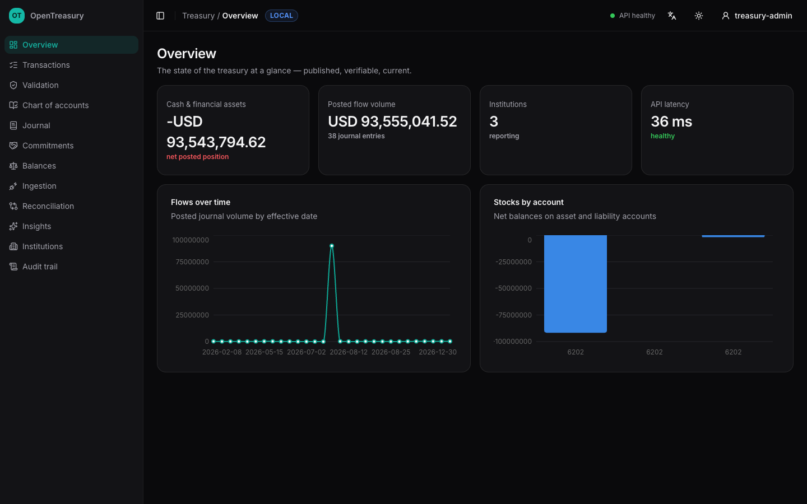

## 3. How it works

### 3.1 The shape of the system

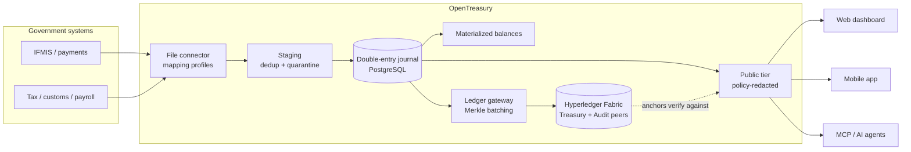

PostgreSQL is the operational system of record — the place where truth lives and where backup discipline matters most. Fabric is the system of *proof*: it never holds operational data, personal information, or free text, only hashes and anchor metadata. Losing the chain loses proofs (recoverable by re-anchoring); losing the database loses the system — which is why the disaster-recovery procedures center on the database.

### 3.2 The financial core

The journal is strict double entry: every entry's debits equal its credits *per currency*, validated before anything touches the database. Posting an entry, updating the materialized balances it moves, and writing its audit event happen in one database transaction — there is no window where the books disagree with themselves.

The invariant that makes the model trustworthy is mechanical: **stocks equal the sum of flows.** For every account, the materialized balance must equal the signed sum of every posted journal line that ever touched it. This is not a convention; it is an integration test that runs against a real PostgreSQL instance in CI, and it has to pass for any change to merge.

Amounts are integers in minor units end to end. Floating point never touches money.

Beyond plain entries, the core understands two treasury disciplines:

- **Commitments** — a signed contract or purchase order encumbers budget *before* money moves. Journal entries settle a commitment by referencing it; the settlement happens inside the same transaction as the posting, over-settlement rejects the entire entry, and the commitment flips to settled exactly when the committed amount is reached. A commitment can never be quietly overspent.
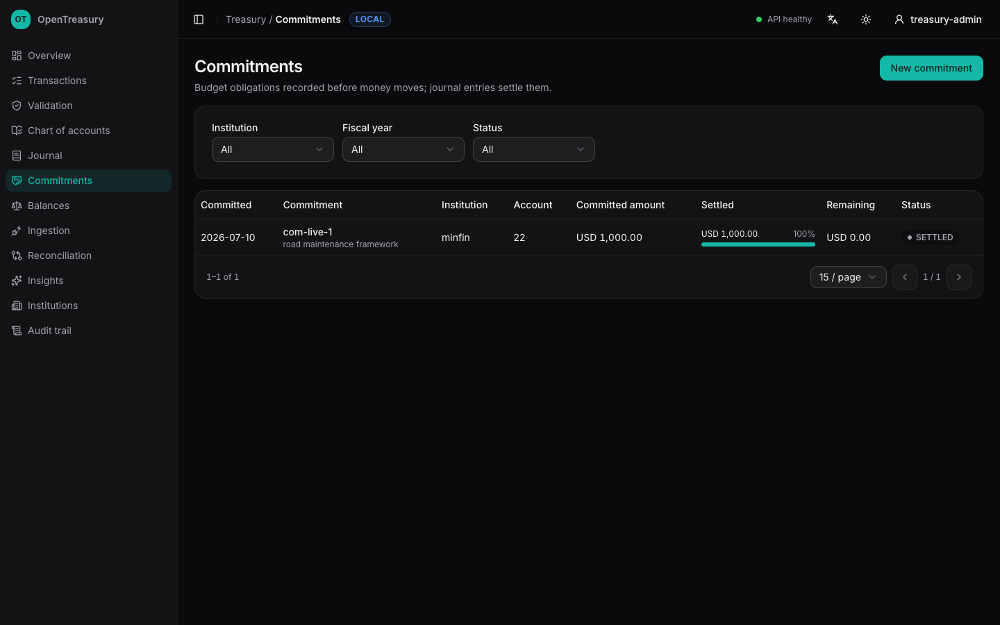

- **Reversals** — posted entries are never edited or deleted. Corrections are new, linked, equal-and-opposite entries, so the history of a mistake is as permanent as the mistake.

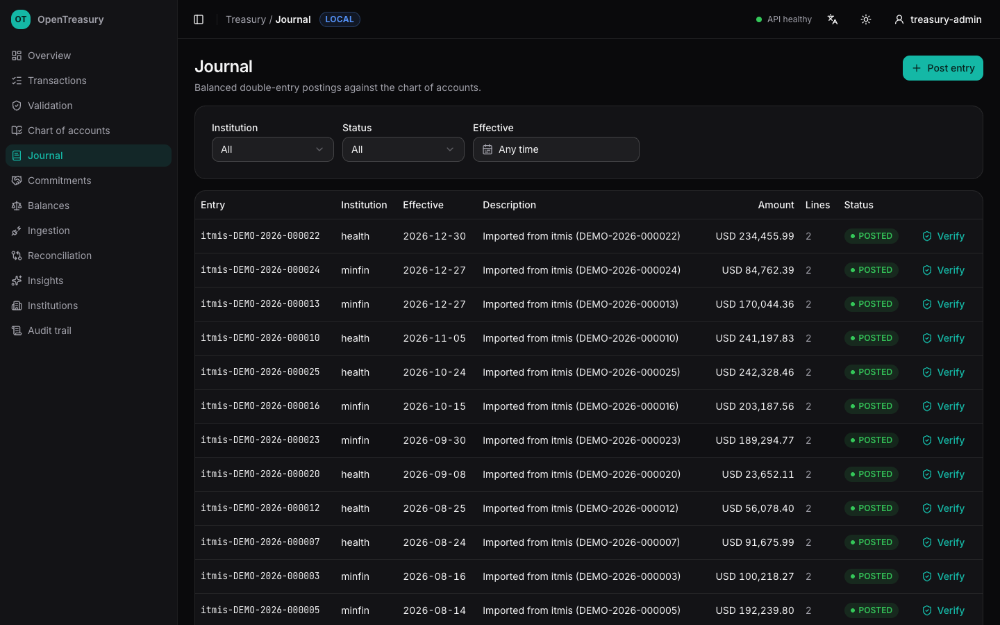

### 3.3 Getting data in: the ingestion pipeline

The connector model assumes the messy reality of government IT. A source system produces a CSV export; a **mapping profile** — a short YAML file a domain expert can review without reading code — declares which columns mean what and which accounts the flows post to. Profiles are versioned artifacts: change a mapping's meaning, bump its version, and redelivered rows hash differently on purpose.

Every record is hashed on arrival. Redelivering the same file converges as duplicates instead of double-posting — connectors get at-least-once delivery semantics without any coordination. Records that fail validation (an unknown institution, a malformed date) are **quarantined with a machine-readable reason**, never guessed at and never silently dropped. Rows that cannot even be mapped are counted and reported.

The **reconciliation view** closes the loop: for every source system and month, it compares what arrived in staging against what actually posted to the journal, to the cent. Amounts agree and nothing is quarantined → *matched*. Amounts agree but records await triage → *attention*. Totals differ → *discrepancy*. An operator — or an auditor — sees at a glance whether the pipeline is telling the whole truth.

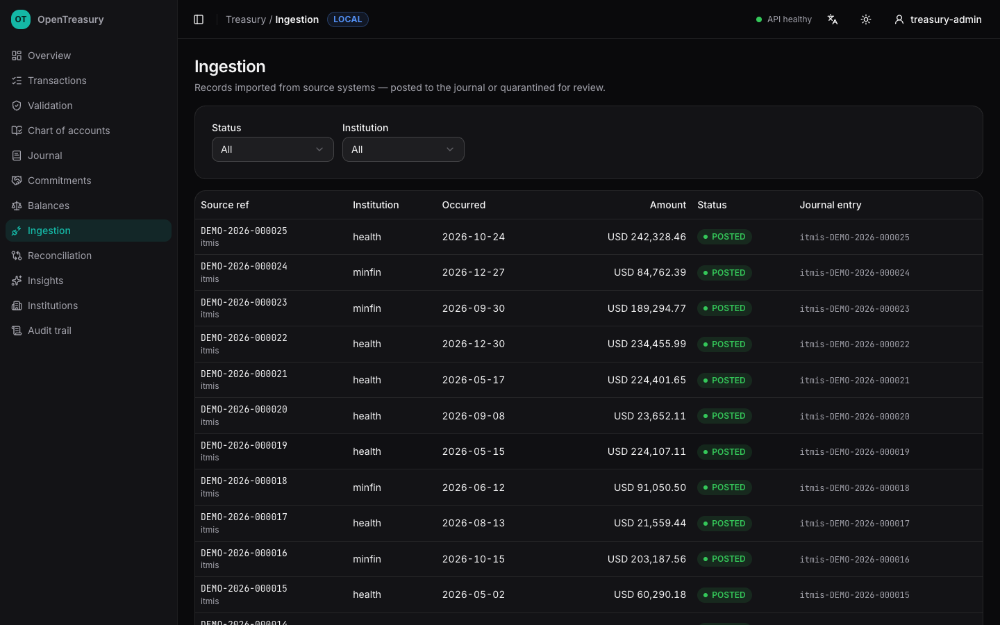

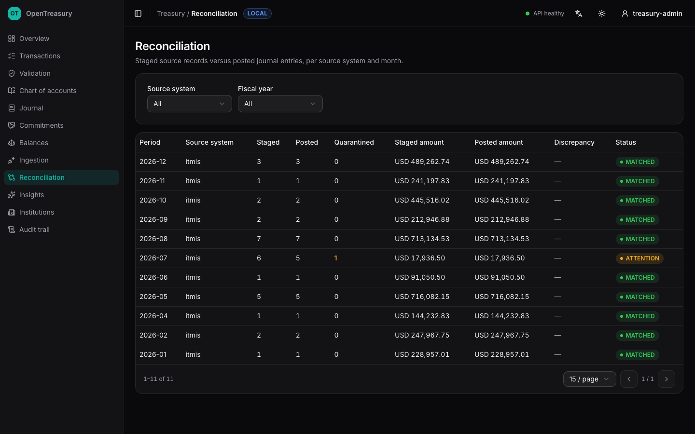

### 3.4 The trust layer: anchoring and verification

This is the part that changes the conversation with the public, so it is worth walking through slowly.

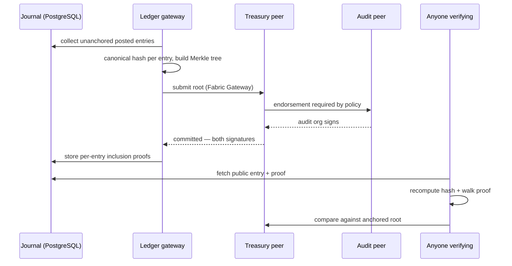

Every posted entry has a **canonical hash**: a documented, versioned SHA-256 encoding of its public-safe fields — identifiers, dates, status, and sorted lines, never free text. The encoding is deliberately boring, because anyone must be able to reproduce it. The Go service, the browser, and the mobile app all implement it independently, and a unit test pins all three to the same byte-for-byte vector: if the implementations ever drift, the build fails.

Every few seconds, the ledger gateway gathers unanchored entries, builds a Merkle tree over their hashes, and commits the root to the Fabric channel. Here the endorsement policy does the political work: the chaincode is committed with **`AND('TreasuryMSP.peer','AuditMSP.peer')`** — an anchor only exists if the treasury *and* the independent audit institution both sign it. We demonstrate this the blunt way: stop the audit peer and anchoring halts with Fabric's own refusal, *"no peer combination can satisfy the endorsement policy."* Start it again and the backlog drains automatically. No single institution can write history alone, and the system is honest about it when they try.

Anchors are immutable by construction — recommitting an existing anchor id with a different root is rejected by the chaincode — and idempotent by design: the Merkle root doubles as the anchor id, so a crash between the chain commit and the proof write converges on retry instead of double-anchoring.

Verification requires trusting nothing but the math. A verifier fetches an entry and its inclusion proof from the public API, recomputes the canonical hash from the entry's published fields, walks the proof to a root, and compares that root with the one on the chain. Change one cent of one line — even by editing the database directly with administrator privileges — and verification fails, publicly, for everyone. We ran exactly that experiment: a direct SQL `UPDATE` adding one cent to a posted line made the verifier print ✗ where it had printed ✓.

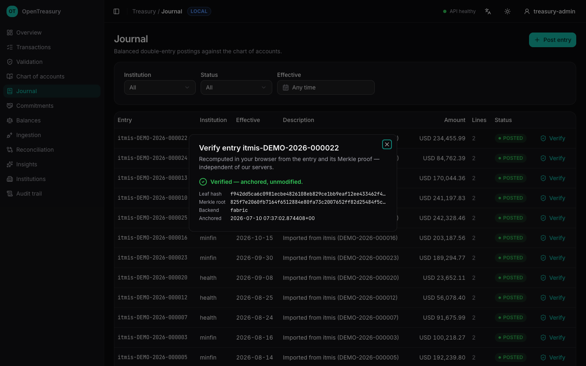

Three independent verifiers ship with the project:

- a **standalone CLI** (`go run ./cmd/verify -entry <id>`) that depends on nothing but the public data,
- an **in-browser check** on every journal entry, using the browser's own WebCrypto,
- and the **mobile app**, which recomputes everything on the device — the strongest statement of the design, because the phone in a citizen's pocket does not have to trust the government's servers.

  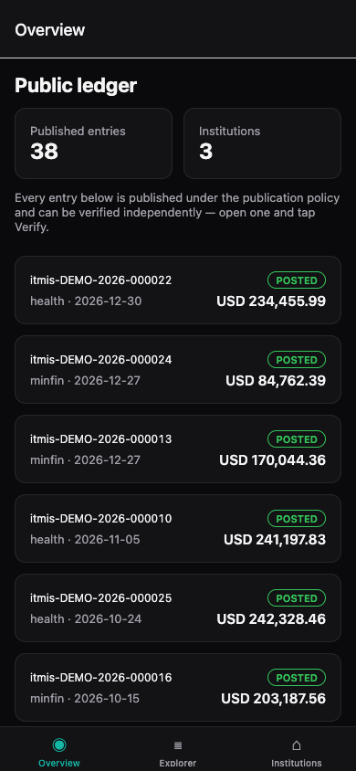
  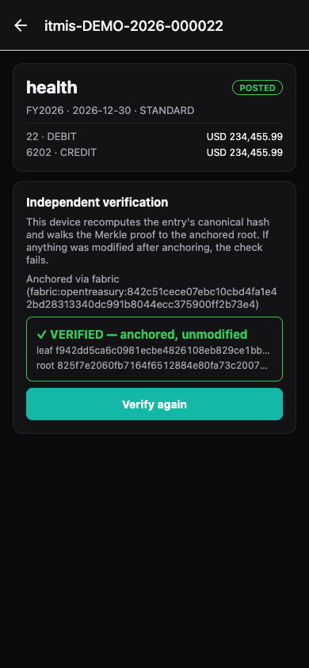

### 3.5 Who sees what: identity and privacy

Transparency is not the same as publishing everything. The privacy model has three layers:

- **Authentication** is standard OIDC against the deployment's identity provider (a reference Keycloak realm ships with the project). The API verifies tokens; it never sees passwords.
- **Authorization** is policy-as-code: an embedded Open Policy Agent module decides every request from role, action, resource, and institution scope. Treasury administrators act across institutions; auditors read everything but write nothing; institution users act only within their own institution; connector identities can *only* write to staging — the ingestion path can never post directly to the journal.
- **Publication** is a separate, explicit policy that decides which fields exist on the anonymous public tier. Journal descriptions and idempotency keys are never published. Crucially, the canonical hash covers only published fields — so redaction never weakens verifiability. The public tier is rate-limited per client and CORS-open on purpose: published data is meant to be read from anyone's tools, not just ours.

Every write, everywhere, produces an append-only audit event in the same transaction as the write itself. The audit trail is not a log file; it is part of the data.

### 3.6 Insights, with the methods on the label

The platform computes two kinds of analytics, and both disclose their method in the API response itself, because numbers a government publishes should say how they were made:

- **Flow projections** — a three-month moving average with an uncertainty band that widens with distance. Deliberately simple: explainable to an auditor in one sentence, wrong in predictable ways, and replaceable behind the same API once a deployment has real history to validate something richer against.
- **Anomaly detection** — the modified z-score (median and MAD) per account, the standard robust-outlier rule. An amount fifty times the typical payment on its account gets flagged with its score and the account's median right next to it; accounts with too little history are honestly skipped rather than guessed about.

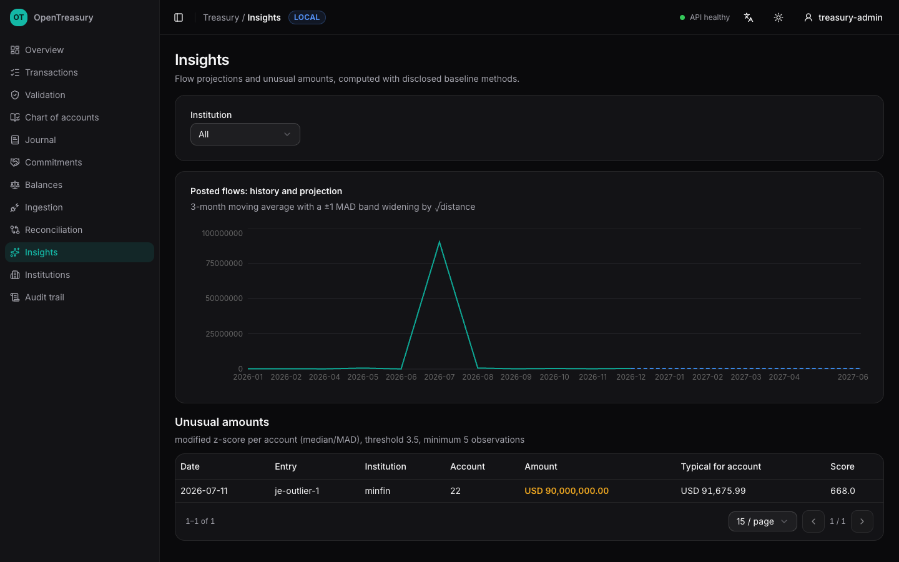

## 4. Running it

**On a laptop:** `make up` starts the full stack in Docker — database, migrations, seeds, identity, API, gateway, connector, web, metrics, dashboards, and log aggregation. `make fabric-up` adds the two-organization Fabric network. A reproducible demo-data generator exercises the entire pipeline end to end, so a pilot team can rehearse everything before touching a real export.

**On Kubernetes:** a Helm chart deploys every service with restrictive security contexts, health probes, and Prometheus annotations. The chart is environment-neutral by policy — PostgreSQL and the identity provider are external dependencies supplied through values, credentials come only from existing Secrets, and nothing sensitive is ever committed. Release images are built in CI, signed with Sigstore (keyless, against the repository's own identity), and carry attested SPDX SBOMs; the release notes include the `cosign verify` one-liner.

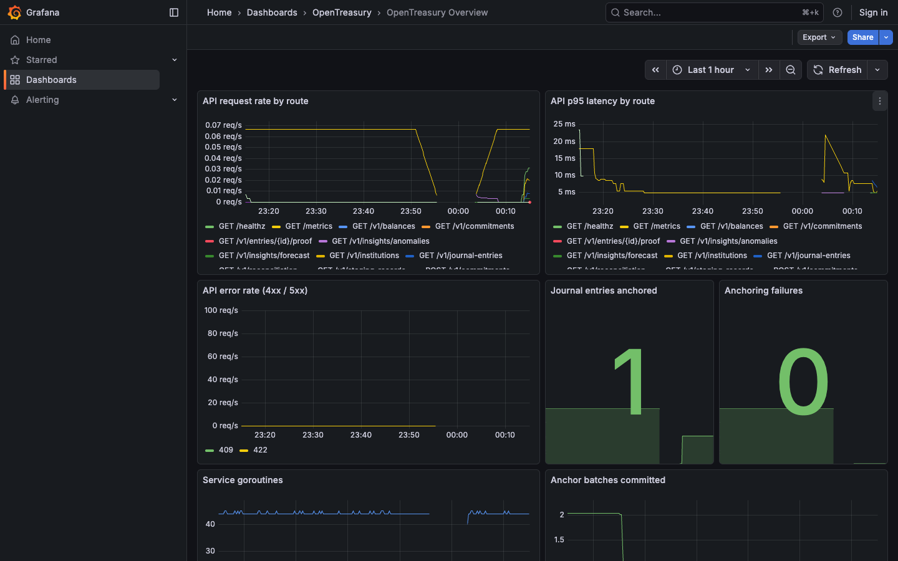

**Operating it:** both Go services expose Prometheus metrics; six alert rules cover the conditions that matter (API errors and latency, anchoring failures, anchor lag, dead components), and each alert links to a runbook that explains impact, diagnosis, and recovery in terms of the system's actual properties — anchoring is idempotent and self-draining, services are stateless and restart freely. Container logs aggregate into Loki, queryable next to the metrics in Grafana. Backup and disaster recovery procedures include a rehearsable restore drill with a distinctive final step: verifying restored entries against pre-existing public anchors, which *proves* the restored data was not modified — the tamper-evidence layer paying an operational dividend.

## 5. What we deliberately did not build yet

Honest scope notes, each with its trigger:

- **Search and read-scaling infrastructure.** The public tier is stateless, cacheable, and rate-limited; anchored data is immutable and therefore hard-cacheable by any CDN. A search cluster joins when measured load or a product need demands it (recorded as an architecture decision), not before.
- **Table partitioning.** The schema is partition-ready; the operational complexity is not worth it below real national volume.
- **Distributed tracing.** Request IDs flow through logs and errors; metrics and logs cover diagnosis today.
- **Sophisticated forecasting.** See section 3.6 — baseline methods until real history exists to validate against.
- **The organizational work.** An external penetration test, real restore drills against production infrastructure, and a production key ceremony (CA-issued identities, HSM-backed keys) require a real deployment and real partners. The pilot kit documents all three paths.

## 6. Project facts

- **License:** open source, vendor-neutral by policy; no proprietary dependency in the critical path.
- **Stack:** Go services; PostgreSQL; Hyperledger Fabric; OPA; Keycloak (reference); React + TypeScript web; Expo mobile; Prometheus/Grafana/Loki; Helm.
- **Assurance:** ~260 tests across unit, integration (real database), contract-conformance (OpenAPI enforced in CI), and automated accessibility gates; every merge passes linting, security scanning (govulncheck, gitleaks, CodeQL, dependency audit), and the full suite.
- **Documentation:** a deployment guide for government IT teams, a data-onboarding playbook (mapping workshop, connector authoring, go-live checklist), operational runbooks, DR procedures, and architecture decision records for every choice that constrains the future.

The deployment guide and onboarding playbook are the practical companions to this paper. The code is the authority for everything else — which is rather the point.
